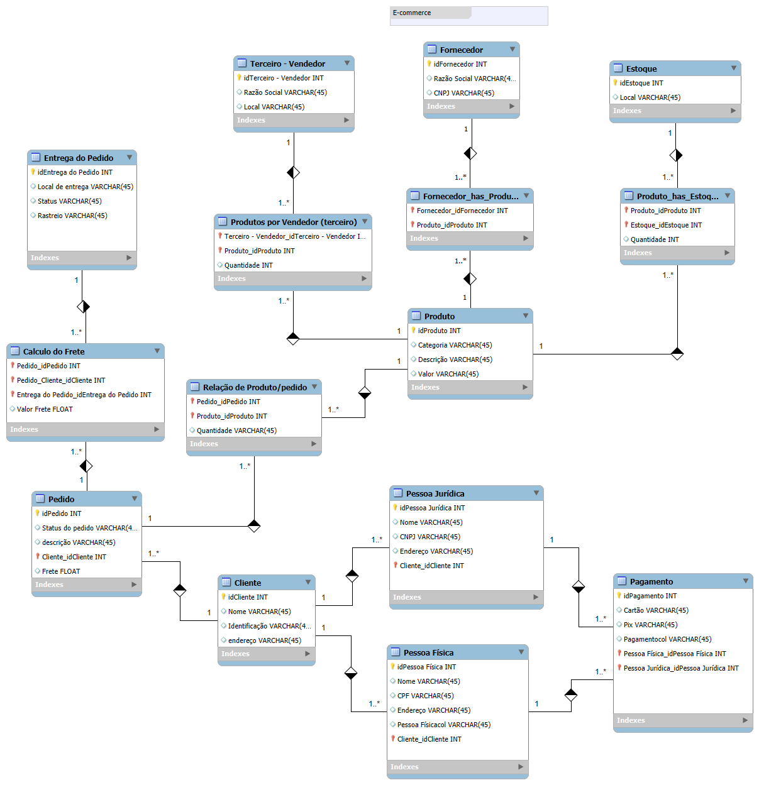

# Projeto E-Commerce

Este projeto apresenta a modelagem de banco de dados para um sistema de e-commerce, incluindo o diagrama conceitual e o script SQL para criação das tabelas no MySQL.

## Estrutura do Projeto

- **ecommerce.mwb**: Arquivo de modelagem física do banco de dados no MySQL Workbench.  
- **projeto_ecommerce.sql**: Script SQL gerado pelo MySQL Workbench para criação das tabelas, chaves primárias e estrangeiras, conforme o modelo conceitual.  
- **ecommerceModel.png**: Imagem do diagrama do banco de dados exportado do Workbench.  
- **Arquivos .bak/.bkp**: Backups automáticos dos arquivos de modelagem.

## Modelo Conceitual

Abaixo está o diagrama conceitual do banco de dados, que representa as principais entidades do sistema, como Cliente, Pedido, Produto, Fornecedor, Estoque, Pagamento, Pessoa Física/Jurídica, entre outros, e seus relacionamentos:

## Explicação dos Arquivos

### ecommerce.mwb
Arquivo de modelagem criado no **MySQL Workbench**.  
Nele estão as tabelas, relacionamentos e constraints do banco de dados, conforme o modelo conceitual do sistema.

Principais entidades modeladas:

- **Cliente** (Pessoa Física e Jurídica)
- **Pedido**
- **Produto**
- **Fornecedor**
- **Estoque**
- **Vendedor Terceiro**
- **Pagamento**
- **Entrega do Pedido**
- **Cálculo do Frete**

O modelo permite visualizar toda a estrutura lógica e relacional do banco.

### projeto_ecommerce.sql
Script SQL gerado a partir do modelo físico no Workbench.  
Contém os comandos para criação das tabelas, chaves primárias, estrangeiras e índices.

Principais tabelas e funções:

- **Cliente**: Cadastro de clientes.  
- **Pessoa Física / Pessoa Jurídica**: Dados específicos de cada tipo de cliente.  
- **Pedido**: Registro dos pedidos realizados.  
- **Produto**: Cadastro de produtos.  
- **Fornecedor**: Cadastro de fornecedores.  
- **Estoque**: Controle de quantidade de produtos.  
- **Pagamento**: Registro dos pagamentos.  
- **Entrega / Frete**: Informações sobre entrega e cálculo de frete.

O script pode ser executado diretamente em um servidor MySQL para criar toda a estrutura do banco de dados.

## Como utilizar

1. Importe o arquivo `ecommerce.mwb` no **MySQL Workbench** para visualizar ou editar o modelo físico.  
2. Exporte o script SQL (`projeto_ecommerce.sql`) se desejar gerar novamente o banco.  
3. Execute o script no seu servidor MySQL para criar as tabelas e relacionamentos.  
4. Consulte a imagem `ecommerceModel.png` para visualizar o modelo conceitual.

## Observações

- O projeto foi estruturado para facilitar futuras expansões e manutenções.  
- Backups automáticos (.bak/.bkp) garantem a segurança da modelagem.  
- O modelo segue boas práticas de normalização e relacionamentos.

---

> Desenvolvido por **Álvaro Gonçalves Rodrigues** no MySQL Workbench, com base no desafio de projeto da DIO.

---

# E-Commerce Project (English Version)

This project presents the database modeling for an e-commerce system, including the conceptual diagram and the SQL script for table creation in MySQL.

## Project Structure

- **ecommerce.mwb**: Physical database modeling file created in MySQL Workbench.  
- **projeto_ecommerce.sql**: SQL script generated by MySQL Workbench for creating tables, primary and foreign keys, according to the conceptual model.  
- **ecommerceModel.png**: Database diagram image exported from Workbench.  
- **.bak/.bkp files**: Automatic backups of modeling files.

## Conceptual Model

Below is the conceptual database diagram, representing the main entities of the system such as Customer, Order, Product, Supplier, Stock, Payment, Individual/Company, among others, and their relationships:

## File Explanations

### ecommerce.mwb
Modeling file created in **MySQL Workbench**.  
Contains tables, relationships, and constraints of the database according to the conceptual model.

Main modeled entities:

- **Customer** (Individual and Company)  
- **Order**  
- **Product**  
- **Supplier**  
- **Stock**  
- **Third-Party Seller**  
- **Payment**  
- **Order Delivery**  
- **Freight Calculation**

### projeto_ecommerce.sql
SQL script generated from the physical model.  
Contains the commands for creating tables, defining primary and foreign keys, and indexes.

Main tables and functions:

- **Customer**: Customer registration.  
- **Individual / Company**: Specific data for each customer type.  
- **Order**: Records of placed orders.  
- **Product**: Product registration.  
- **Supplier**: Supplier registration.  
- **Stock**: Product quantity control.  
- **Payment**: Payment records.  
- **Delivery / Freight**: Delivery and freight calculation information.

## How to Use

1. Import the file `ecommerce.mwb` into **MySQL Workbench** to view or edit the physical model.  
2. Export or run the SQL script (`projeto_ecommerce.sql`) to create the database.  
3. View the conceptual diagram in `ecommerceModel.png`.

## Notes

- The project was structured to allow easy maintenance and scalability.  
- Backup files ensure the safety of modeling data.  
- The model follows database normalization and relationship best practices.

---

> Developed by **Álvaro Gonçalves Rodrigues** using MySQL Workbench, based on the DIO project challenge.

---
